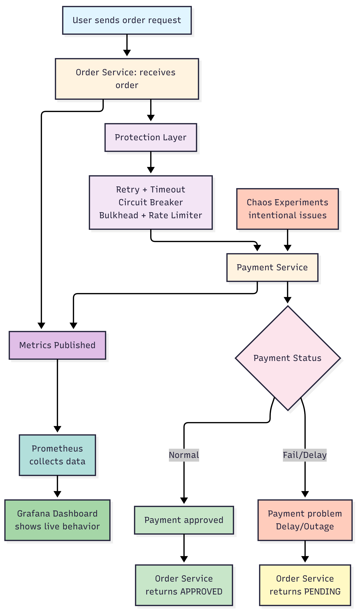
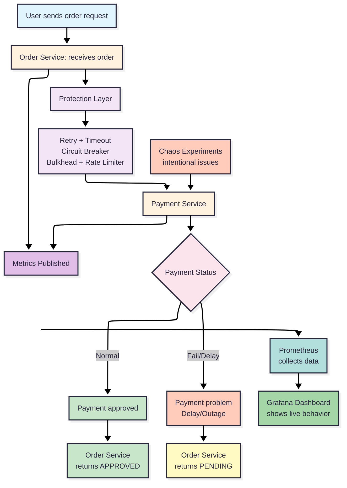

# Project Overall Flow

## What this project is doing in simple words
Think of this project like an online shopping system with safety features.

- One part takes customer orders.
- Another part handles payment.
- We intentionally create problems (like payment delay or payment outage).
- The order system is designed to stay calm, keep responding, and avoid crashing.
- We watch everything on dashboards to prove the system is still healthy.

So the full demo shows: **"Even when something breaks, the customer experience remains controlled."**

## Big-picture flow graph (image)

## Big-picture flow graph (Mermaid.ai source for re-export)

## How a live demo usually runs
1. Start all services.
2. Show normal working flow (order is approved).
3. Turn on failure mode in payment.
4. Send orders again and show fallback response instead of a crash.
5. Open dashboards and show how system health changes.
6. Optionally run chaos tests in Kubernetes for real failure simulation.
7. Return system to normal mode.

## Folder-by-folder and file-by-file explanation

### Root level
- `README.md`: Short starting guide. It tells what this project contains and how to run it quickly.

### `.git/`
- This is version history storage (like project memory). It tracks changes over time.
- All files here are internal Git tracking files.

### `.idea/`
- Editor settings for IntelliJ. Helps the IDE remember preferences.

### `.vscode/`
- Editor settings for VS Code.
- `.vscode/settings.json`: Local editor behavior settings.

### `docs/`
- This folder is your speaking support material for the session.
- `docs/demo-flow.md`: Step-by-step commands for running the demo.
- `docs/failure-scenarios.md`: List of problem situations you will simulate.
- `docs/rollback-plan.md`: How to safely return system to normal.
- `docs/project-overall-flow-explanation.md`: This file (full simple explanation).

### `scripts/`
- Helper scripts so you can run demo quickly without typing long commands.
- `scripts/run-local.sh`: Builds and starts the full local stack.
- `scripts/run-load-test.sh`: Sends multiple orders quickly (simulates traffic/load).
- `scripts/run-chaos.sh`: Applies a selected chaos experiment in Kubernetes.

### `infra/`
- Infrastructure setup for local demo tools.
- `infra/docker-compose.yml`: Starts Order Service, Payment Service, Prometheus, and Grafana together.
- `infra/prometheus/prometheus.yml`: Tells Prometheus where to collect system metrics from.
- `infra/grafana/provisioning/datasources/datasource.yml`: Auto-connects Grafana to Prometheus.

### `chaos/`
- Ready-made failure experiments for Kubernetes demo.
- `chaos/litmus/pod-delete.yaml`: Simulates sudden service crash by deleting a running pod.
- `chaos/litmus/network-latency.yaml`: Simulates slow network response.
- `chaos/litmus/cpu-hog.yaml`: Simulates high CPU pressure.

### `resilience/` (Order Service)
This is the main service that users call.

- `resilience/pom.xml`: Build instructions and required libraries for Order Service.
- `resilience/Dockerfile`: Container recipe to run Order Service in Docker.
- `resilience/mvnw`, `resilience/mvnw.cmd`: Maven wrappers (build tool launcher for Linux/Windows).
- `resilience/.mvn/wrapper/maven-wrapper.properties`: Maven wrapper configuration.
- `resilience/.gitignore`: Tells Git which generated files not to track.
- `resilience/.gitattributes`: Git text/binary handling rules.
- `resilience/HELP.md`: Default starter help text from Spring project template.

#### `resilience/src/main/java/com/demo/resilience/`
- `ResilienceEngineeringApplication.java`: Main entry point. Starts Order Service.

#### `resilience/src/main/java/com/demo/resilience/client/`
- `PaymentClient.java`: Connector from Order Service to Payment Service.

#### `resilience/src/main/java/com/demo/resilience/config/`
- `AsyncConfig.java`: Creates background worker threads for timeout-protected calls.
- `FeignConfig.java`: Enables detailed client call logging.

#### `resilience/src/main/java/com/demo/resilience/controller/`
- `OrderController.java`: API endpoint where user sends order request.

#### `resilience/src/main/java/com/demo/resilience/service/`
- `OrderService.java`: Core business logic and resilience safety rules (retry, timeout, circuit breaker, etc.).

#### `resilience/src/main/java/com/demo/resilience/model/`
- `OrderRequest.java`: Shape of incoming order data.
- `OrderResponse.java`: Shape of outgoing order result.
- `PaymentResponse.java`: Shape of payment result used by Order Service.

#### `resilience/src/main/java/com/demo/resilience/exception/`
- `GlobalExceptionHandler.java`: Generic error handler so responses remain controlled.

#### `resilience/src/main/resources/`
- `application.yml`: Main configuration (ports, resilience rules, metrics exposure).
- `application.properties`: Additional app identity setting.

#### `resilience/src/test/java/com/demo/resilience/`
- `ResilienceEngineeringApplicationTests.java`: Basic startup test.

#### `resilience/target/`
Generated build output folder.
- `classes/...`: Compiled application files.
- `maven-archiver/pom.properties`: Build metadata.
- `resilience-0.0.1-SNAPSHOT.jar`: Packaged runnable application.
- `resilience-0.0.1-SNAPSHOT.jar.original`: Original packaged artifact copy.
- `surefire-reports/...`: Test execution reports.

### `services/payment-service/` (Payment Service)
This is the downstream dependency. It is intentionally controllable so you can show failure behavior safely.

- `services/payment-service/pom.xml`: Build instructions and required libraries.
- `services/payment-service/Dockerfile`: Container recipe for Payment Service.
- `services/payment-service/mvnw`, `services/payment-service/mvnw.cmd`: Build launcher scripts.
- `services/payment-service/.mvn/wrapper/maven-wrapper.properties`: Maven wrapper configuration.

#### `services/payment-service/src/main/java/com/demo/payment/`
- `PaymentServiceApplication.java`: Main entry point. Starts Payment Service.

#### `services/payment-service/src/main/java/com/demo/payment/controller/`
- `PaymentController.java`: Payment APIs and failure-mode control APIs.
- `PaymentErrorHandler.java`: Error response formatter for predictable outputs.

#### `services/payment-service/src/main/java/com/demo/payment/service/`
- `PaymentFailureService.java`: Switches behavior modes (normal, always fail, delay, random fail).

#### `services/payment-service/src/main/java/com/demo/payment/model/`
- `PaymentRequest.java`: Incoming payment data format.
- `PaymentResponse.java`: Payment result format.
- `FailureMode.java`: Available failure mode types.
- `FailureModeRequest.java`: Input model to change failure behavior.

#### `services/payment-service/src/main/resources/`
- `application.yml`: Port and metrics configuration for payment app.

#### `services/payment-service/src/test/java/com/demo/payment/`
- `PaymentServiceApplicationTests.java`: Basic startup test.

## Simple "story" you can say in session
A customer places an order. The order service tries to take payment. If payment is healthy, order is approved. If payment is down or slow, the order service does not collapse. Instead, it gives a safe response and keeps the system available. At the same time, monitoring tools show exactly what happened, so teams can recover fast and confidently.
